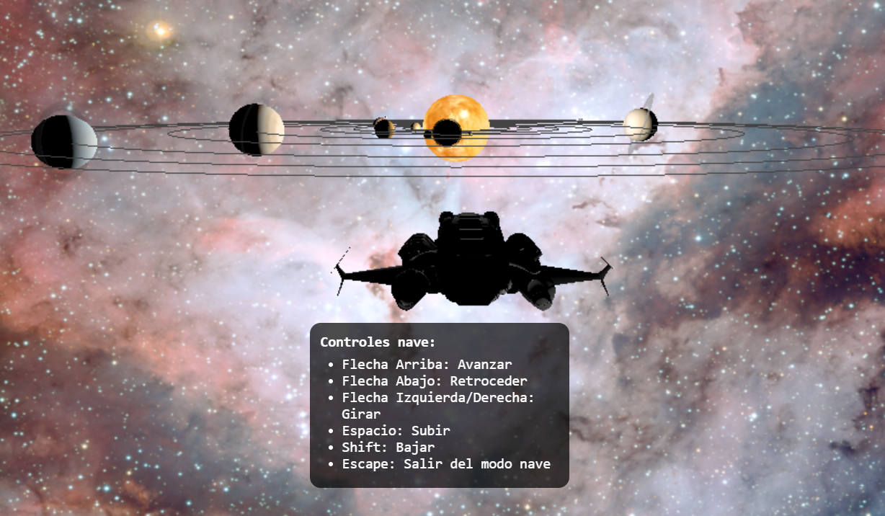

# Sistema Solar Interactivo en 3D

Este proyecto es un **simulador interactivo del sistema solar**, que cuenta con todos los planetas del sistema solar, algunos satélites, anillos y objetos especiales como la Estación Espacial Internacional y una nave espacial controlable. Incluye información detallada de los planetas y un menú con control de órbitas y rotaciones.

---

# Video de demostración

  

---

## Características principales

### Planetas y cuerpos celestes
- Mercurio, Venus, Tierra, Marte, Júpiter, Saturno, Urano, Neptuno y Plutón.
- Satélites naturales: Luna, Fobos y Deimos.
- Anillos visuales en Júpiter, Saturno, Urano y Neptuno.
- Capa de nubes en la Tierra con rotación independiente.

### Objetos especiales
- **Estación Espacial Internacional (ISS)** orbitando la Tierra.
- **Nave espacial controlable** (modo exclusivo, no es solo una vista).

### Interacción
- Vistas individuales de planetas y del Sol mediante índice.
- Panel lateral con información científica (extraída de `planetas.json`).
- Control de órbitas y rotaciones vía **dat.GUI**.

  

---

## Nave espacial (modo exclusivo)
La nave espacial no es solo una cámara o vista: es un **modo de control interactivo** que permite moverte libremente por el sistema solar.

**Cómo activarla:**
1. Hacer clic en el botón “Nave” en el índice inferior.
2. La cámara se engancha a la nave en tercera persona.
3. Controles disponibles mientras la nave está activa:

| Tecla        | Acción                    |
|-------------|---------------------------|
| Flecha Arriba | Avanzar                  |
| Flecha Abajo  | Retroceder               |
| Flecha Izquierda | Girar a la izquierda   |
| Flecha Derecha  | Girar a la derecha     |
| Espacio      | Subir                    |
| Shift        | Bajar                    |
| Escape       | Salir del modo nave y volver a cámara libre |

  

> Nota: Durante el modo nave, **las órbitas y rotaciones de los planetas se pausan automáticamente** para centrar la experiencia de vuelo.

---

## Vistas individuales
- Cada planeta y el Sol tienen su vista exclusiva que se puede activar desde el índice.  
- Al seleccionarlas, la cámara se mueve suavemente hacia el objeto y se muestra un **panel con información**.

  

---

## Estructura del código

- **`init()`**  
  Inicializa la escena, cámara, renderer, controles de cámara (`OrbitControls`) y carga de texturas y modelos 3D.

- **`planetaConTextura()`**  
  Crea un planeta con su geometría, material, textura, bump map y su órbita.

- **`lunaConTextura()`**  
  Crea una luna para un planeta específico.

- **`capaNubes()`**  
  Añade una capa de nubes translúcida a la Tierra.

- **`Sol()`**  
  Crea el Sol con luz puntual para iluminar el sistema solar.

- **`agregarEstacionEspacial()`**  
  Añade la ISS como un objeto que orbita la Tierra.

- **`crearIndicePlanetas() / crearIndiceSol() / crearIndiceNaveOBJ()`**  
  Crea botones de interfaz para acceder rápidamente a las vistas de cada planeta, el Sol o la nave.

- **`mostrarInfo()`**  
  Despliega un panel lateral con información detallada del planeta seleccionado, extraída de `planetas.json`.

- **`animationLoop()`**  
  - Actualiza rotaciones de planetas y nubes.  
  - Actualiza posiciones en órbita de planetas, lunas y la ISS.  
  - Controla la cámara cuando la nave está activa, siguiendo su posición y dirección.  
  - Renderiza la escena.

---

## Archivos de recursos

**Modelos 3D**
- Nave espacial: `spaceship_flying.obj` + `.mtl` ([Free3D](https://free3d.com/3d-model/kameri-explorer-57154.html))
- Estación Espacial Internacional: `iss.glb` ([NASA](https://science.nasa.gov/3d-resources/international-space-station-iss-b/))

**Texturas**
- Fuente: [Planet Pixel Emporium](https://planetpixelemporium.com/), [Solar System Scope](https://www.solarsystemscope.com/)
- Sol: `/textures/2k_sun.jpg`
- Planetas: mapas y bump maps individuales
- Capa de nubes de la Tierra: `/textures/earthcloudmaptrans_invert.jpg` + `/textures/earthcloudmap.jpg`
- Anillos: `/textures/saturnring.png` ([DeviantArt](https://www.deviantart.com/alpha-element/art/Stock-Image-Saturn-Rings-393767006))

**Datos planetarios**
- Archivo JSON: `/files/planetas.json`  
  Contiene nombre, descripción, día, año, masa, gravedad, temperatura y satélites.

---
